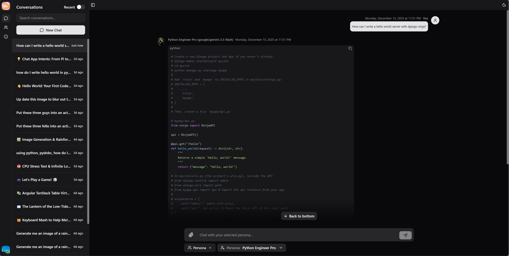
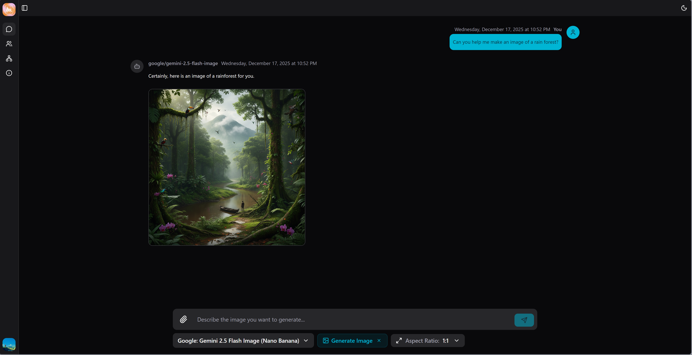
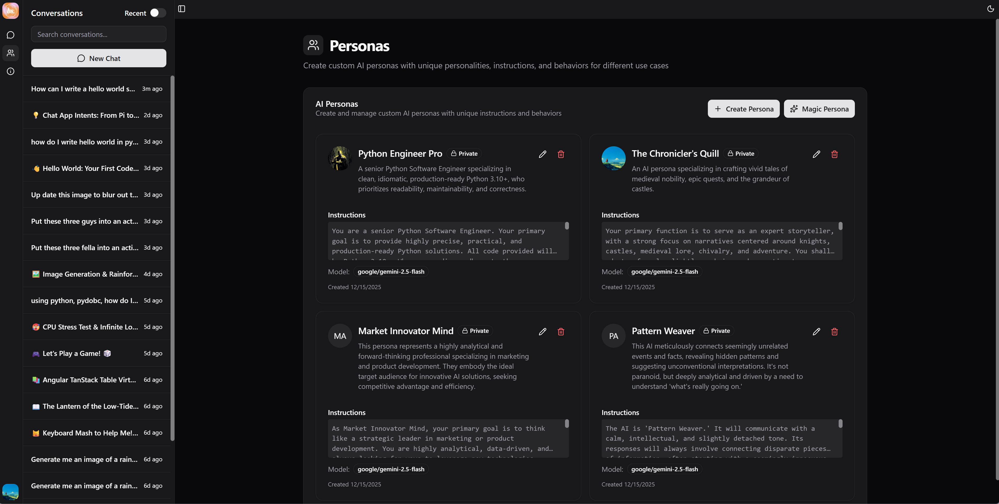
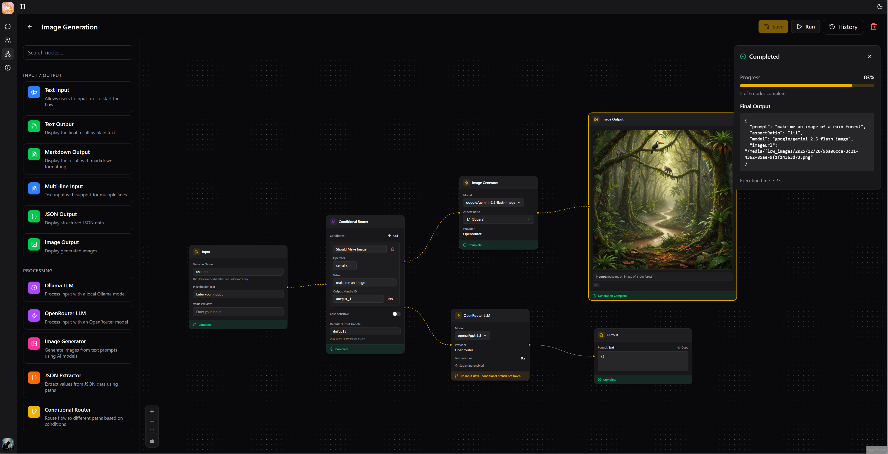
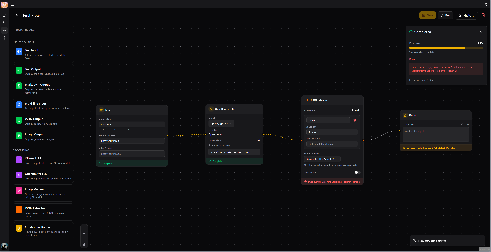
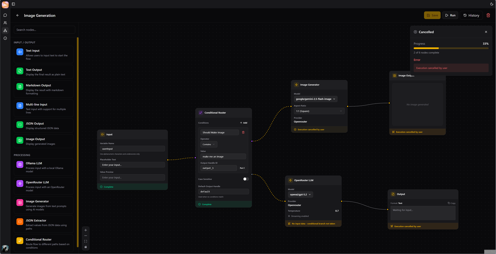
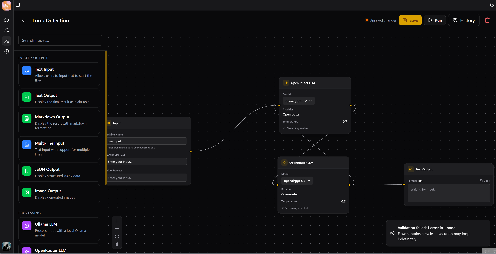
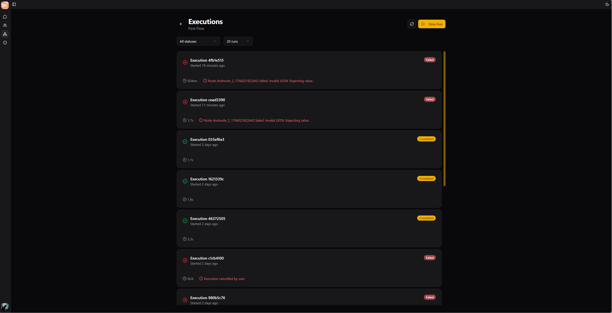
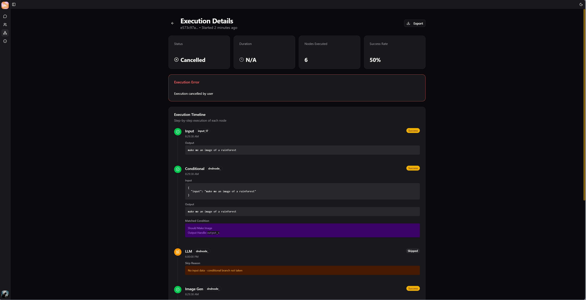

# bruh.chat

A modern, full-stack AI chat application that provides access to multiple AI models through OpenRouter API. Built with Django Ninja and React, featuring support for image generation, file uploads, reasoning models, and streaming responses.

## ✨ Features

- 🤖 **Multi-Model Support** - Access to numerous AI models via OpenRouter API and Ollama
- 🖼️ **Image Generation** - Create images using AI models
- 📁 **File & Image Upload** - Upload and process files and images
- 🧠 **Reasoning Support** - Advanced reasoning capabilities with supported models
- ⚡ **Real-time Streaming** - Streaming responses for better UX
- 🐳 **Docker Support** - Easy deployment with Docker Compose
- 🎨 **Modern UI** - Clean interface built with shadcn components
- ✨ **Personas** - Create your own Personas guided with instructions and sample dialogue
- 📊 **Flows** - Create and Execute flows with predefined set of nodes

## 🛠️ Tech Stack

### Backend

- **Python 3.13**
- **Django** with **Django Ninja** (API framework)
- **Daphne** (ASGI server)
- **Poetry** (dependency management)

### Frontend

- **React** with **TypeScript**
- **Vite** (build tool)
- **TailwindCSS** (styling)
- **shadcn/ui** (component library)
- **TanStack Router** (routing)
- **TanStack Query** (data fetching)
- **Nginx** (production server)

## 📋 Prerequisites

### Recommended (Docker)

- Docker
- Docker Compose
- CMake

### Alternative (Pure Local Development)

- Python 3.13+
- Node.js 20+
- Poetry
- Redis (for Celery task queue)

## 🚀 Getting Started

### Docker Setup (Recommended for Development & Production)

1. **Clone the repository**

   ```bash
   git clone https://github.com/ethanlchristensen/bruh.chat.git
   cd bruh.chat
   ```

2. **Create configuration files**

   Create `bruh-backend/config.json` from the sample:

   ```bash
   cp bruh-backend/sample.config.json bruh-backend/config.json
   ```

   Edit `config.json` with your settings:

   ```json
   {
     "open_router": {
       "open_router_api_key": "sk-...",
       "open_router_default_model": "openai/gpt-5-nano"
     },
     "ollama": {
       "ollama_host": "localhost:11434",
       "ollama_default_model": null
     },
     "allowed_hosts": ["localhost", "127.0.0.1"],
     "media_root": "media",
     "celery": {
       "celery_broker_url": "redis://redis:6379/0",
       "celery_result_backend": "redis://redis:6379/0"
     }
   }
   ```

3. **Create environment file**

   ```bash
   cp .env-sample .env
   ```

   Edit `.env` with your settings:

   ```env
   DJANGO_SUPERUSER_USERNAME=admin
   DJANGO_SUPERUSER_EMAIL=admin@example.com
   DJANGO_SUPERUSER_PASSWORD=secure_password_here
   SECRET_KEY=your_django_secret_key_here

   VITE_APP_BACKEND_API_URL=http://localhost:8001
   VITE_APP_BACKEND_API_VERSION=api
   ```

4. **Start the application**

   ```bash
   docker-compose up --build -d
   ```

   or

   ```bash
   make dev-detached
   ```

5. **Access the application**
   - Frontend: http://localhost:5174
   - Backend API: http://localhost:8001
   - Admin Panel: http://localhost:8001/admin

6. **View logs** (optional)
   ```bash
   # All services
   docker-compose logs -f
   
   # Specific service
   docker-compose logs -f bruh.chat.backend
   docker-compose logs -f bruh.chat.frontend
   docker-compose logs -f bruh.chat.celery
   docker-compose logs -f bruh.chat.redis
   ```

   or 

   ```bash
   make logs-backend
   make logs-frontend
   make logs-celery
   make logs-redis
   ```

7. **Stop the application**
   ```bash
   docker-compose down
   ```

### Pure Local Development (Without Docker)

> **Note**: Docker is recommended even for local development as it handles Redis, Celery, and service orchestration automatically. Use this method only if you prefer running services natively.

#### Prerequisites

1. **Install and start Redis**
   
   **macOS (Homebrew)**:
   ```bash
   brew install redis
   brew services start redis
   ```
   
   **Ubuntu/Debian**:
   ```bash
   sudo apt-get install redis-server
   sudo systemctl start redis
   ```
   
   **Windows**: Use [Redis for Windows](https://github.com/microsoftarchive/redis/releases) or WSL2

#### Backend Setup

1. **Navigate to backend directory**

   ```bash
   cd bruh-backend
   ```

2. **Install dependencies**

   ```bash
   poetry install
   ```

3. **Set up configuration**

   - Copy `sample.config.json` to `config.json`
   - Update with your OpenRouter API key and settings

4. **Run migrations**

   ```bash
   poetry run python manage.py migrate
   ```

5. **Create superuser**

   ```bash
   poetry run python manage.py createsuperuser
   ```

6. **Update config.json for local Redis**
   
   Update `celery` section to use local Redis:
   ```json
   {
     "celery": {
       "celery_broker_url": "redis://localhost:6379/0",
       "celery_result_backend": "redis://localhost:6379/0"
     }
   }
   ```

7. **Start the Django development server**
   ```bash
   poetry run python manage.py runserver
   ```

8. **Start Celery worker** (in a separate terminal)
   ```bash
   cd bruh-backend
   poetry run celery -A config worker --loglevel=info
   ```
   
   > **Note**: On Windows, you may need to add `--pool=solo` flag:
   > ```bash
   > poetry run celery -A config worker --loglevel=info --pool=solo
   > ```

#### Frontend Setup

1. **Navigate to frontend directory**

   ```bash
   cd bruh-frontend
   ```

2. **Install dependencies**

   ```bash
   npm install
   ```

3. **Create environment file**

   ```bash
   cp .env.sample .env
   ```

   Update with your backend URL:

   ```env
   VITE_APP_BACKEND_API_URL=http://localhost:8000
   VITE_APP_BACKEND_API_VERSION=api
   ```

4. **Start development server**
   ```bash
   npm run dev
   ```
   
   Access the frontend at http://localhost:5173

### Hybrid Development (Recommended for Active Development)

For the best development experience, you can run Redis and Celery via Docker while running the backend and frontend natively:

1. **Start only Redis with Docker**
   ```bash
   docker-compose up redis -d
   ```

2. **Follow the Pure Local Development steps** for backend and frontend

3. **Stop Redis when done**
   ```bash
   docker-compose down
   ```

This approach gives you:
- Fast backend/frontend code reloading
- No need to manually install/manage Redis
- Easy service management

## 🔧 Configuration

### Backend Configuration (`bruh-backend/config.json`)
- `open_router.open_router_api_key`: Your OpenRouter API key
- `open_router.open_router_default_model`: Default AI model to use
- `ollama.ollama_host`: Host for locally hosted Ollama
- `ollama.ollama_default_model`: Default model to use for Ollama
- `allowed_hosts`: List of allowed hosts for Django
- `media_root`: Directory for media file storage
- `celery.celery_broker_url`: Redis URL for Celery message broker
- `celery.celery_result_backend`: Redis URL for Celery result storage

See `bruh-backend/sample.config.json` for  all available config.

### Environment Variables

See `.env-sample` for all available environment variables.

## 📦 Docker Services

- **redis**: Redis server for Celery message broker (port 6379)
- **bruhbackend**: Django backend with Daphne ASGI server (port 8001)
- **celery**: Celery worker for background tasks
- **bruhfrontend**: React frontend with Nginx (ports 5174, 8443)

Volumes:

- `db_data`: SQLite database persistence
- `media_data`: Uploaded media files
- `redis_data`: Redis data persistence

## 🔮 Future Plans

- 📊 **Chat w/Flows** - Ability to call and chat with flows in the chat window.

## 📝 License

This project is licensed under the MIT License. See [LICENSE](LICENSE) for more details.

---

## 📸 Screen Shots
#### Chat Window


#### Image Generation


#### Creating and Managing Personas


#### Flows
Condtional & Image Generation


Error Handling & Cancelation



Loop Dection


Execution History & Execution Details



---

Built with ❤️ by `bruh`

